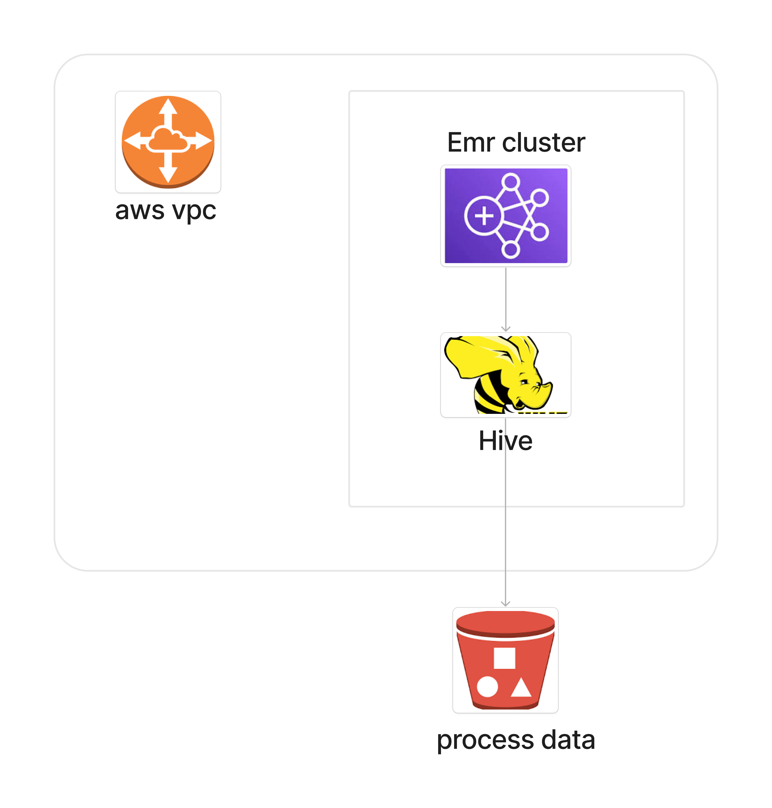

# ETL Pipeline on Amazon EMR through AWS CDK!

Aim:

The objective of this project is to build an ETL Pipeline on Amazon EMR through AWS CDK. The pipeline will involve carrying out data analysis and transformation using Apache Hive on EMR. Additionally,

 
Tech Stack

Language: Python

Services: AWS S3, AWS EMR, Apache Hive

## Diagram Architecture

